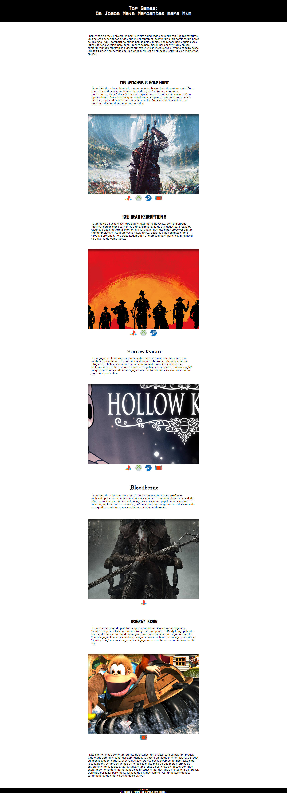

# Meu Site de Jogos Favoritos 🎮

Este é o repositório do meu site de jogos favoritos, uma página simples criada com o propósito de compartilhar os jogos que mais me marcaram e que considero os melhores. O site foi desenvolvido como um projeto de estudos para aprimorar meus conhecimentos em HTML, CSS e JavaScript, e também para explorar a técnica de background fixed.

## Visão Geral

O site é uma simples página única que apresenta uma lista dos meus top 5 jogos favoritos. Cada jogo é apresentado com uma imagem, um título e um pequeno resumo. Além disso, há um cabeçalho com o título do site e uma breve introdução sobre o objetivo da página.

## Background Fixed

Uma das principais características deste site é a utilização da técnica de background fixed nas seções de cada jogo. Essa técnica permite que a imagem de fundo permaneça fixa enquanto o conteúdo da página rola, criando um efeito visual interessante e dando destaque aos jogos apresentados.

## Como Visualizar o Site

Para visualizar o site, basta acessar o [link] (https://mattheus910.github.io/projeto-jogos/) em qualquer navegador moderno.

## Créditos de Imagens

As imagens utilizadas para representar os jogos no site foram obtidas de diferentes fontes, sendo elas:

- The Witcher 3: Wild Hunt - Imagem de The Witcher 3.
- Red Dead Redemption 2 - Imagem de Red Dead Redemption 2.
- Hollow Knight - Imagem de Hollow Knight.
- Bloodborne - Imagem de Bloodborne.
- Donkey Kong - Imagem de Donkey Kong.

## Créditos do Ícone

O ícone utilizado no cabeçalho do site foi obtido do site [Icons8](https://icons8.com.br/). É importante ressaltar que o site oferece diversos ícones gratuitos para uso, com atribuições adequadas conforme solicitado.

## Contato

Se você tiver alguma dúvida, sugestão ou feedback sobre o site, sinta-se à vontade para entrar em contato comigo pelo github ou linkedin. Estou sempre aberto a melhorias e novas ideias!

Espero que você goste do meu site e que ele possa servir como inspiração para seus próprios projetos! Obrigado por visitar!

## Licença

Este projeto está sob a [Licença MIT](link_para_licenca_mit).
